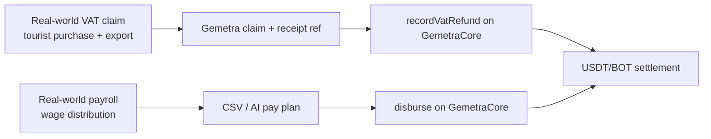
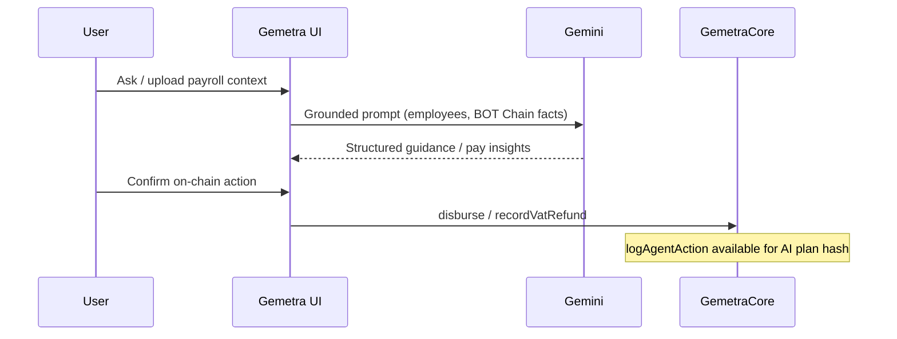

# BOT Chain Builder Challenge #2 — Submission Notes

**Project:** Gemetra  
**Tracks:** **RWA Applications** (primary) · **AI Native Applications** (supporting / dual-track narrative)  
**Live demo:** https://gemetra-botchain-ten.vercel.app  
**Repository:** https://github.com/AmaanSayyad/Gemetra-BotChain  
**Demo video:** https://youtu.be/U1QJ2HDRRQE  

---

## Requirement checklist

| Requirement | Mandatory | Status | Evidence |
| --- | --- | --- | --- |
| BOT Chain **Mainnet** deployment | Yes | Done | `GemetraCore` `0xf924220b12dbedb039245c0b960b7dbb37bf1eb2` on chain **677** · [BOTScan](https://scan.botchain.ai/address/0xf924220b12dbedb039245c0b960b7dbb37bf1eb2) · deploy tx `0xb565ca7f…64443` |
| Product form / complete user loop | Yes | Done | Landing → wallet connect → VAT / payroll / scheduled payouts → BOTScan verification |
| Wallet interaction | Yes | Done | Reown AppKit (MetaMask, BO Wallet, WalletConnect, …) on `eip155:677` |
| Public website / online demo | Yes | Done | https://gemetra-botchain-ten.vercel.app |
| GitHub repository | Yes | Done | https://github.com/AmaanSayyad/Gemetra-BotChain |
| Demo video | Recommended | Done | https://youtu.be/U1QJ2HDRRQE |
| Project originality | Yes | Done | Original Gemetra product; **migrated** settlement from prior L1 to BOT Chain with new core + frontend |

---

## Track alignment

### RWA Applications (primary)

- **Asset authenticity:** VAT amounts and payroll salaries map to real-world obligations (tax reclaim / wages).  
- **Business loop:** claim/payrun → wallet signature → on-chain event + transfer → explorer proof + Supabase record.  
- **Compliance feasibility:** receipt metadata, claim IDs, and immutable `VatRefundRecorded` / `Disbursed` events support audit trails.

### AI Native Applications

- AI is used for **payroll parsing**, **ops Q&A**, and **grounded product facts** (not generic marketing copy only).  
- On-chain hooks: settlement via `disburse` / VAT via `recordVatRefund`; `logAgentAction` is on `GemetraCore` for agent audit (wire into live agent confirmations as you deepen the AI track).

---

## Migration answers (required for migrated projects)

### Why BOT Chain?

- EVM toolchain familiarity with **low-fee, fast finality** rails suited to remittance.  
- Native ecosystem USDT + BOT DEX/bridge/wallet infrastructure.  
- Aligns with BOT’s **RWA + AI agent economy** direction for tax and payroll products.

### What does the BOT Chain version add?

| Capability | Detail |
| --- | --- |
| `GemetraCore` | Custody-free batch `disburse`, VAT registry, agent action log |
| Network | Mainnet `677` + testnet toggle for engineering |
| Wallets | Full Reown AppKit EVM adapter (not a superficial RPC swap) |
| Tokens | Bridged USDT ERC-20 + native BOT payouts in the same UX |
| Product | End-to-end web app hosted on Vercel with explorer links |

### How will you grow users & on-chain activity?

1. SME payroll cohorts (recurring `disburse` volume).  
2. Tourist VAT corridors (claim registry + refund txs).  
3. Iterate AI → on-chain agent logging for automated payruns.  
4. Stay on BOT mainnet for demo day, grants, and ecosystem listing.

---

## Review-criteria self score (honest)

| Dimension | Weight | Notes |
| --- | --- | --- |
| Product completion | 30% | Strong loop; polish RLS, treasury points conversion, live Gemini key for demos |
| Mainnet integration | 25% | Contract + frontend + explorer verified |
| Innovation | 20% | Dual VAT+payroll remittance on BOT; deepen AI→chain |
| UX | 15% | Landing-first, AppKit connect, dashboard |
| Technical quality | 10% | viem/wagmi, Solidity core, Supabase |

---

## Judge quick-start

1. Open https://gemetra-botchain-ten.vercel.app  
2. Connect wallet → switch / add **BOT Chain (677)**  
3. Fund small **BOT** (gas) + optional **USDT**  
4. Run a payroll preview or VAT claim → confirm tx on [BOTScan](https://scan.botchain.ai)  
5. Read architecture sequences in [README.md](./README.md)  

---

## Core infrastructure references

- https://www.botchain.ai/  
- https://dev-docs.botchain.ai/docs/Developers/quick-guide/  
- https://scan.botchain.ai/  
- https://bridge.botchain.ai/  
- https://dex.botchain.ai/  
- https://wallet.botchain.ai/  
