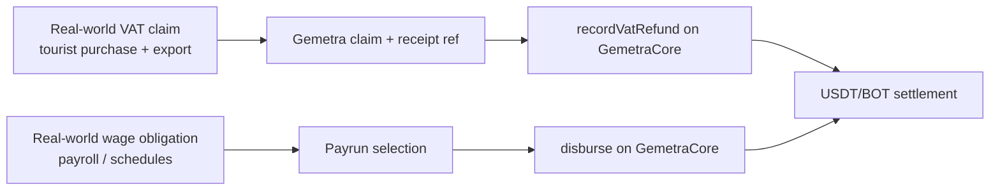
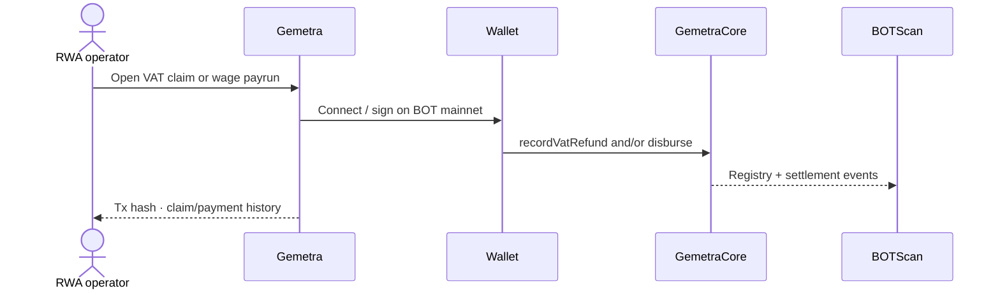

# BOT Chain Builder Challenge #2 — RWA Submission

**Project:** Gemetra  
**Track:** **RWA Applications** (Real World Assets)  
**Live demo:** https://gemetra-botchain-ten.vercel.app  
**Repository:** https://github.com/AmaanSayyad/Gemetra-BotChain  
**Demo video:** https://youtu.be/U1QJ2HDRRQE  

Gemetra is submitted as an **RWA remittance application**: it digitizes and settles **real-world VAT reclaim claims** and **wage distribution obligations** on BOT Chain Mainnet.

---

## Requirement checklist

| Requirement | Mandatory | Status | Evidence |
| --- | --- | --- | --- |
| BOT Chain **Mainnet** deployment | Yes | Done | `GemetraCore` `0xf924220b12dbedb039245c0b960b7dbb37bf1eb2` on chain **677** · [BOTScan](https://scan.botchain.ai/address/0xf924220b12dbedb039245c0b960b7dbb37bf1eb2) · deploy tx `0xb565ca7f…64443` |
| Product form / complete user loop | Yes | Done | Landing → wallet → **VAT claim / wage disburse** → BOTScan verification |
| Wallet interaction | Yes | Done | Reown AppKit on `eip155:677` |
| Public website / online demo | Yes | Done | https://gemetra-botchain-ten.vercel.app |
| GitHub repository | Yes | Done | https://github.com/AmaanSayyad/Gemetra-BotChain |
| Demo video | Recommended | Done | https://youtu.be/U1QJ2HDRRQE |
| Project originality | Yes | Done | Original Gemetra product; **migrated** settlement to BOT Chain with new core + frontend |

---

## RWA track alignment

| RWA review focus | How Gemetra responds |
| --- | --- |
| **Authenticity of assets** | VAT amounts map to tax reclaim; payroll amounts map to wages owed |
| **Business loop completeness** | Claim/payrun → wallet signature → on-chain event + transfer → explorer + DB record |
| **Compliance feasibility** | Receipt metadata, claim IDs, immutable `VatRefundRecorded` / `Disbursed` events |

---

## Migration answers

### Why BOT Chain?

- Low-fee, fast-finality EVM rails suited to **remittance of real-world obligations**.  
- Ecosystem USDT + bridge/DEX/wallet for stable settlement.  
- Aligns with BOT’s **RWA infrastructure** direction (asset distribution, claim registry, auditability).

### What does the BOT Chain version add?

| Capability | Detail |
| --- | --- |
| `GemetraCore` | Custody-free `disburse` + VAT claim registry |
| Network | Mainnet `677` (challenge / production) |
| Wallets | Full Reown AppKit EVM adapter |
| Tokens | Bridged USDT ERC-20 + native BOT payouts |
| Product | End-to-end web app on Vercel with BOTScan links |

### How will you grow users & on-chain activity?

1. Tourist **VAT reclaim** corridors (claim registry + refund txs).  
2. SME **wage distribution** cohorts (recurring `disburse` volume).  
3. Stay on BOT mainnet for Demo Day, ecosystem listing, and continued claim/payrun throughput.

---

## Review-criteria notes (RWA)

| Dimension | Weight | Notes |
| --- | --- | --- |
| Product completion | 30% | Full VAT + wage loops on mainnet |
| Mainnet integration | 25% | Contract + frontend + explorer verified |
| Innovation | 20% | Dual RWA remittance (tax reclaim + wages) on one core |
| UX | 15% | Landing-first, AppKit, claim/payrun dashboards |
| Technical quality | 10% | viem/wagmi, Solidity core, Supabase |

---

## Judge quick-start (RWA path)

1. Open https://gemetra-botchain-ten.vercel.app  
2. Connect wallet → **BOT Chain (677)**  
3. Fund small **BOT** (gas) + **USDT**  
4. Run a **VAT claim** and/or **wage bulk disburse** → confirm on [BOTScan](https://scan.botchain.ai)  
5. Skim RWA sequences in [README.md](./README.md)  

---

## Core infrastructure

- https://www.botchain.ai/  
- https://dev-docs.botchain.ai/docs/Developers/quick-guide/  
- https://scan.botchain.ai/  
- https://bridge.botchain.ai/  
- https://dex.botchain.ai/  
- https://wallet.botchain.ai/  
