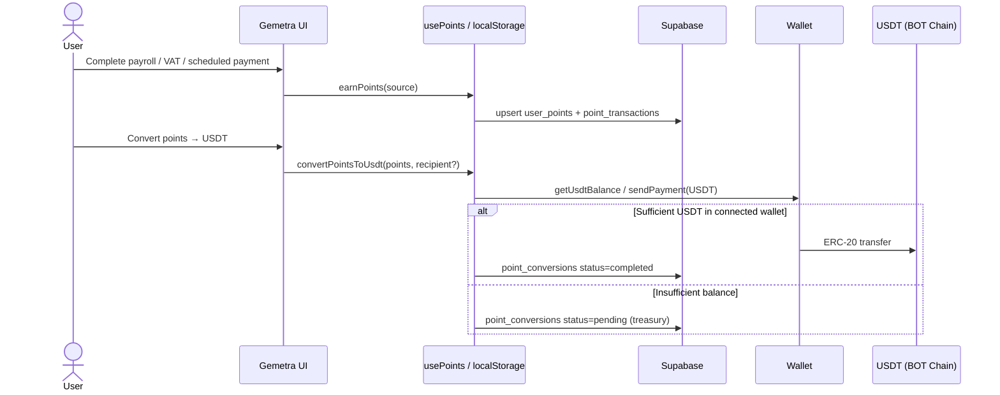
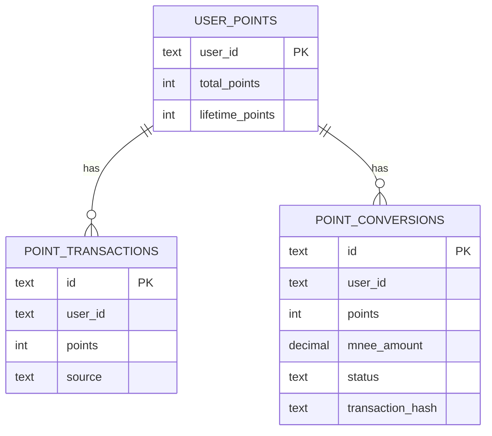

# Points System

Gemetra includes a lightweight points layer on top of payroll, scheduled payments, and VAT refunds. Points are tracked per **wallet** and surfaced in the top bar. Conversion is denominated as **USDT** on **BOT Chain**.

---

## Flow

---

## Earning

Points are awarded for completed flows (see `POINTS_RULES` in `src/hooks/usePoints.ts`):

| Source | Typical award |
| --- | --- |
| Single payment | +10 |
| Bulk payroll (per employee factor) | +5 × count |
| Scheduled payment | +3 |
| VAT refund | +15 |

---

## Conversion

- **Rate:** `100` points ⇒ `1` USDT (`CONVERSION_RATE` in `usePoints.ts`).  
- **Path:** `convertPointsToUsdt` → `sendPayment(..., "USDT")` when the connected wallet holds enough USDT; otherwise records **pending** (treasury-backed fulfillment in production).  
- Recipient defaults to the connected wallet; UI allows an alternate BOT Chain address.

---

## Storage

| Layer | Detail |
| --- | --- |
| Primary | `localStorage` keys `gemetra_points_*`, `gemetra_point_transactions_*` |
| Secondary | Supabase `user_points`, `point_transactions`, `point_conversions` |
| Legacy column | `mnee_amount` stores the **USDT** amount (historical column name) |

---

## Future

- Dedicated treasury wallet for reliable USDT delivery on conversion.  
- Optional on-chain points receipt via `logAgentAction` / dedicated events.
