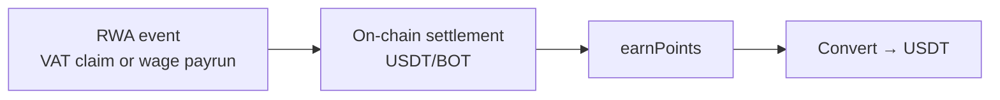
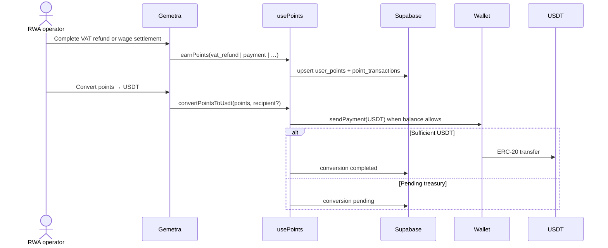
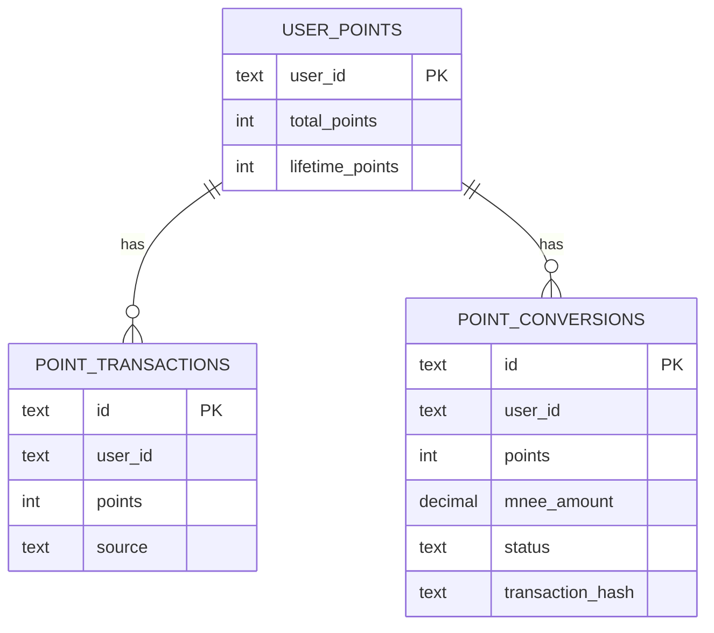

# Points System (RWA engagement)

Points reward **completed real-world settlement flows** in Gemetra—primarily **VAT reclaim** and **wage distribution**—so operators who close RWA loops on BOT Chain earn engagement credit convertible toward **USDT**.

---

## Why this matters for RWA

| Action | Real-world obligation | Points role |
| --- | --- | --- |
| VAT refund | Tax reclaim claim settled | Highest earn (+15) — core RWA claim close |
| Bulk / single wage pay | Payroll distribution | Earn on each settled obligation |
| Scheduled wage run | Recurring wage obligation | Earn when due run settles |

---

## Flow

---

## Earning (RWA-weighted)

See `POINTS_RULES` in `src/hooks/usePoints.ts`:

| Source | Typical award | RWA meaning |
| --- | --- | --- |
| VAT refund | **+15** | Tax reclaim claim closed |
| Single payment | +10 | Single wage / payout obligation |
| Bulk payroll (× employees) | +5 × count | Batch wage distribution |
| Scheduled payment | +3 | Recurring wage run settled |

---

## Conversion

- **Rate:** `100` points ⇒ `1` USDT.  
- **Path:** `convertPointsToUsdt` → `sendPayment(..., "USDT")` on BOT Chain when the connected wallet holds enough USDT; otherwise **pending** (treasury fulfillment).  
- Default recipient = connected wallet (optional alternate EVM address).

---

## Storage

| Layer | Detail |
| --- | --- |
| Primary | `localStorage` `gemetra_points_*`, `gemetra_point_transactions_*` |
| Secondary | Supabase `user_points`, `point_transactions`, `point_conversions` |
| Legacy column | `mnee_amount` = **USDT** amount |

---

## Future (RWA)

- Treasury-backed USDT delivery for claim operators.  
- Tie conversion receipts to VAT claim IDs / payrun refs for stronger audit linkage.
