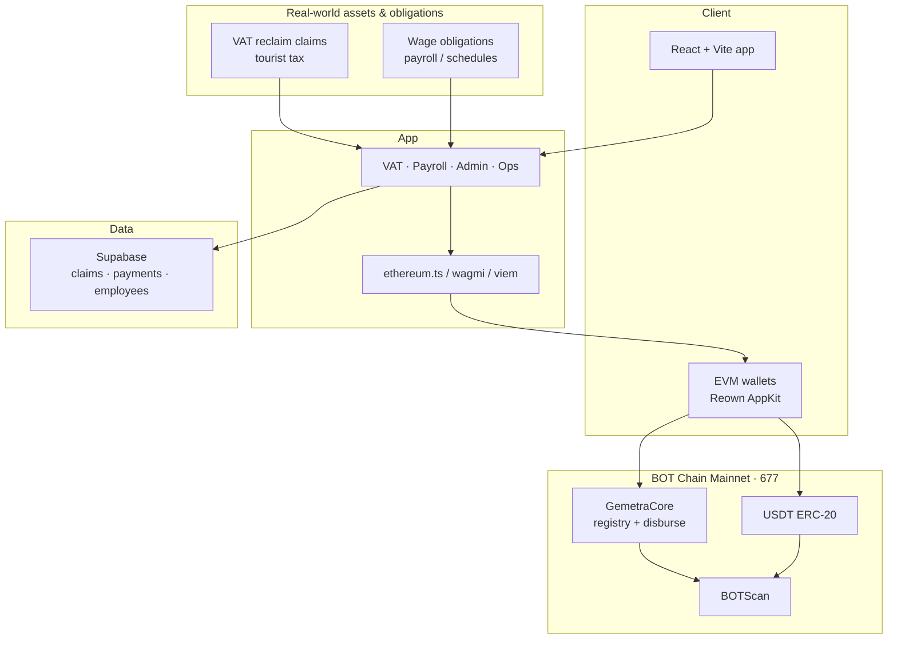
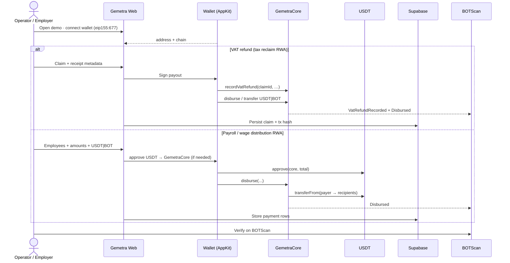
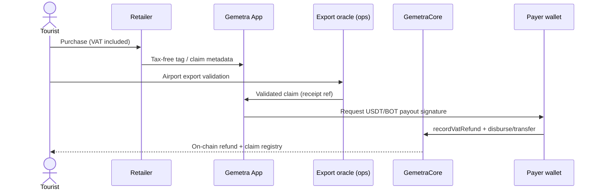
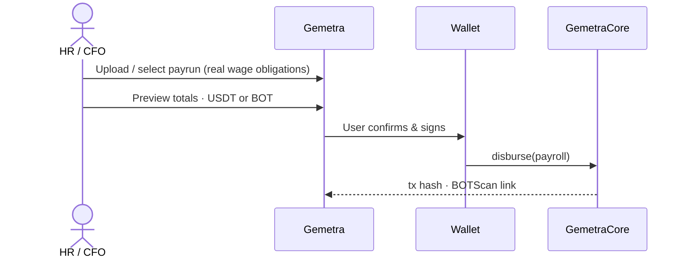
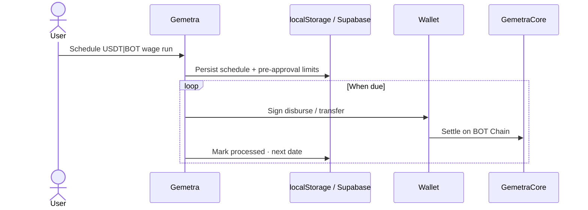

# Gemetra — RWA Remittance on BOT Chain Mainnet

**Real-world VAT refunds & wage distribution** settled in **USDT / native BOT** on **BOT Chain Mainnet** (chain ID **677**).

| | |
| --- | --- |
| **Track** | **RWA Applications** (BOT Builder Challenge #2) |
| **Live demo** | https://gemetra-botchain-ten.vercel.app |
| **GitHub** | https://github.com/AmaanSayyad/Gemetra-BotChain |
| **Demo video** | https://youtu.be/U1QJ2HDRRQE |
| **Pitch deck** | https://docs.google.com/presentation/d/1QxKpMPxLiS-bpKkow8S5PApxNrgUUppg64oxbx-tU28/edit?usp=sharing |
| **GemetraCore** | https://scan.botchain.ai/address/0xf924220b12dbedb039245c0b960b7dbb37bf1eb2 |

---

## Overview

Gemetra is an **RWA remittance app**: tourist **VAT reclaim claims** and **payroll wage obligations** are captured in the app, then closed with wallet-signed **USDT or BOT** on BOT Chain. `GemetraCore` never custodies funds — it **`disburse`**s batch payouts and **`recordVatRefund`** for an immutable claim registry. Users connect via Reown AppKit (MetaMask, BO Wallet, WalletConnect); proofs live on BOTScan with metadata in Supabase.

| Flow | Real-world obligation | On-chain close |
| --- | --- | --- |
| VAT refund | Tax reclaim after export validation | `recordVatRefund` + USDT/BOT payout |
| Payroll / schedules | Wages owed to workers | `disburse` batch settlement |

Contract source: [`contracts/GemetraCore.sol`](./contracts/GemetraCore.sol)

---

## Deployment

### Mainnet (production / challenge)

| Item | Value |
| --- | --- |
| Network | BOT Chain Mainnet · chain ID **677** |
| RPC | `https://rpc.botchain.ai` |
| Explorer | https://scan.botchain.ai |
| **GemetraCore** | `0xf924220b12dbedb039245c0b960b7dbb37bf1eb2` |
| Deploy tx | [`0xb565ca7f…64443`](https://scan.botchain.ai/tx/0xb565ca7f27e8a8055f4bfe19ebb05da711d62072f6200f46657bdff326a64443) |
| USDT | `0xababc7ddc03e501d190c676bf3d92ef0e6e87a3c` |

Artifact: [`deployments/botchain-mainnet.json`](./deployments/botchain-mainnet.json)

### Testnet (dev)

| Item | Value |
| --- | --- |
| Network | BOT Chain Testnet · chain ID **968** |
| Explorer | https://scan.bohr.life |
| **GemetraCore** | `0xf924220b12dbedb039245c0b960b7dbb37bf1eb2` |
| Deploy tx | [`0x2659121d…ee21b`](https://scan.bohr.life/tx/0x2659121de64c8e4b59e7a6b52a5c019ec4d333737d48bd979b569082cc1ee21b) |
| USDT | `0x75edC9335175Fc0552D51D48439F229c10420fe3` |

Artifact: [`deployments/botchain-testnet.json`](./deployments/botchain-testnet.json)

---

## Architecture



### End-to-end RWA product loop



### VAT refund (core RWA)



### Wage distribution (RWA)



### Scheduled wage runs



---

## Features

- VAT refunds + **VAT Admin** (filter, export, clear cache)
- Bulk payroll CSV → preview → `disburse`
- Scheduled USDT/BOT wage runs
- Points on completed settlements ([POINTS_SYSTEM.md](./POINTS_SYSTEM.md))
- Optional in-app ops assistant

---

## Stack & quick start

| Layer | Tech |
| --- | --- |
| Frontend | React 18, Vite, Tailwind |
| Wallets | wagmi, viem, Reown AppKit |
| Chain | BOT Chain Mainnet `677` |
| Data | Supabase |
| Hosting | Vercel |

```bash
pnpm install && cp .env.example .env && pnpm dev
```

Set `VITE_BOTCHAIN_NETWORK=mainnet` and `VITE_GEMETRA_CORE_ADDRESS=0xf924220b12dbedb039245c0b960b7dbb37bf1eb2`. See [`.env.example`](./.env.example).

Deploy contracts (optional): `pnpm wallet:create && pnpm deploy:core`

---

## Challenge submission Q&A

Form-ready answers for BOT Builder Challenge #2. **Contract addresses and explorer links are in [Deployment](#deployment) above.**

### Project overview

**Problem:** Tourists miss billions in VAT refunds (kiosks, paperwork, slow banks); employers face costly cross-border wage payouts.

**How it works:** Connect wallet on chain 677 → submit VAT claim or payroll payrun → sign USDT/BOT settlement → verify on BOTScan.

**Target users:** Tourists & VAT operators (e.g. UAE/Dubai), SMEs & Web3 teams with distributed workers, finance/HR admins needing auditable remittance.

### Why BOT Chain?

Low-fee EVM remittance rails; **USDT + BOT** settlement; RWA-friendly claim registry + audit; BOTScan / bridge / wallet ecosystem; full migration with new `GemetraCore` and AppKit — not an RPC swap.

### What is new in the BOT Chain version?

Custody-free **`GemetraCore`** (`disburse`, `recordVatRefund`, `logAgentAction`); Reown AppKit on **677**; bridged USDT + native BOT; live Vercel app with VAT Admin, bulk payroll, and scheduled runs; legacy non-EVM paths removed.

### Growth after the Challenge

1. **VAT corridors** — UAE/Dubai operators & retailers → recurring `recordVatRefund` + payouts  
2. **SME payroll** — remote teams → recurring `disburse` batches  
3. **Enterprise APIs** — fintech / HR SaaS integrations; more VAT geographies  
4. **Network effects** — operator loyalty once mainnet volume is established  

**Metrics:** disburse volume, claim count, unique wallets, monthly recurring payruns.

---

## Documentation

| Doc | Purpose |
| --- | --- |
| [CHALLENGE_SUBMISSION.md](./CHALLENGE_SUBMISSION.md) | Checklist & judge quick-start |
| [VAT_REFUND_DOCUMENT_FORMAT_GUIDE.md](./VAT_REFUND_DOCUMENT_FORMAT_GUIDE.md) | Receipt / claim formats |
| [VAT_REFUND_SAMPLE_DATA.md](./VAT_REFUND_SAMPLE_DATA.md) | Sample payloads |
| [POINTS_SYSTEM.md](./POINTS_SYSTEM.md) | Engagement points |
| `samples/` | JSON / CSV examples |

---

## License & contact

MIT — see [LICENSE](./LICENSE)

- Email: amaansayyad2001@gmail.com  
- GitHub: [@AmaanSayyad](https://github.com/AmaanSayyad)  
- Telegram: [@amaan029](https://t.me/amaan029)
