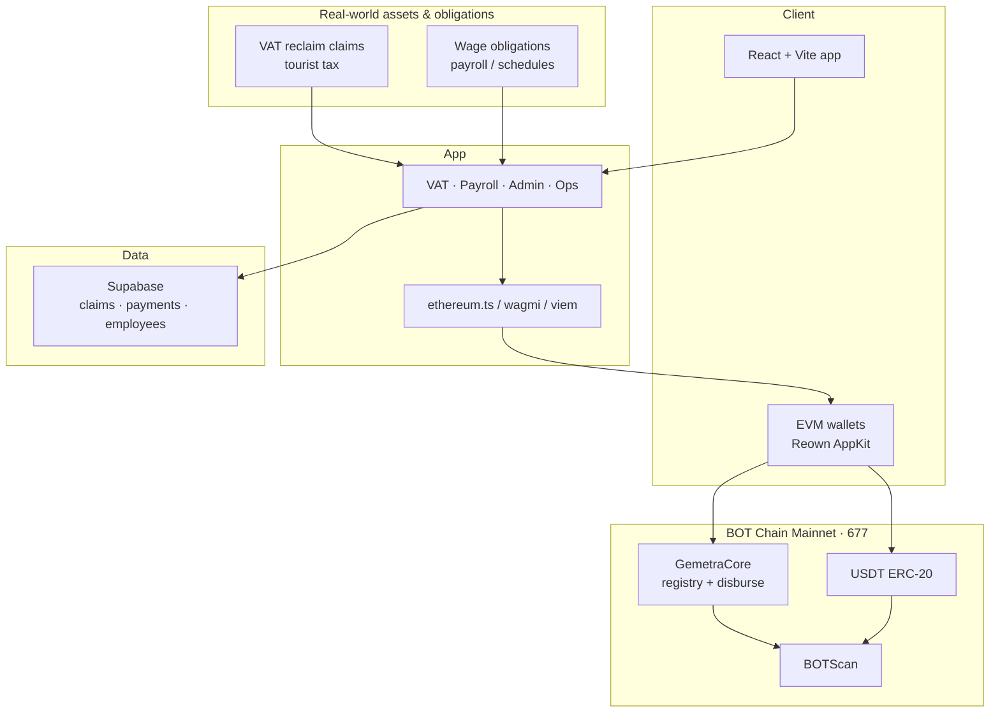
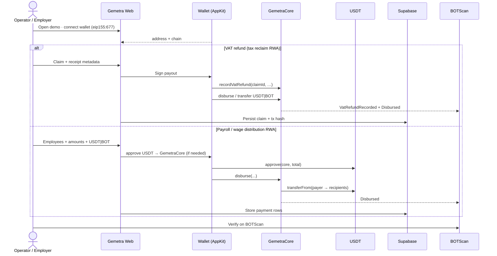
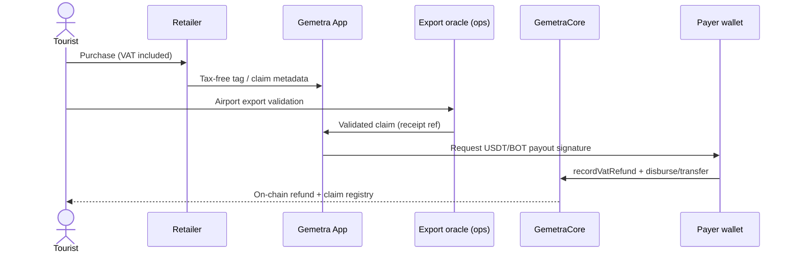
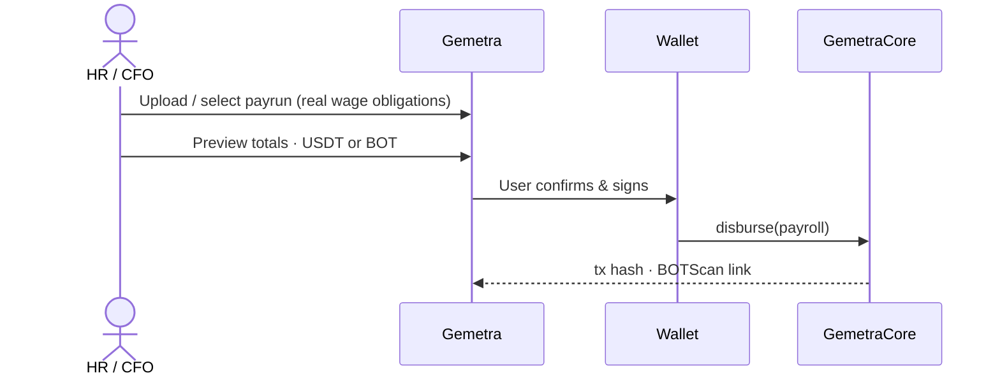
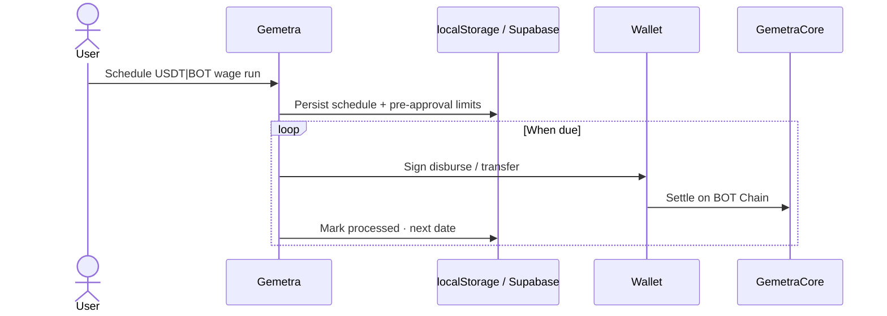

# Gemetra — RWA Remittance on BOT Chain Mainnet

**Real-world VAT refunds & wage distribution** settled in **USDT / native BOT** on **BOT Chain Mainnet** (chain ID **677**).

| | |
| --- | --- |
| **Track** | **RWA Applications** (BOT Builder Challenge #2) |
| **Live demo** | https://gemetra-botchain-ten.vercel.app |
| **GitHub** | https://github.com/AmaanSayyad/Gemetra-BotChain |
| **Demo video** | https://youtu.be/U1QJ2HDRRQE |
| **Pitch deck** | https://docs.google.com/presentation/d/1QxKpMPxLiS-bpKkow8S5PApxNrgUUppg64oxbx-tU28/edit?usp=sharing |
| **Explorer (GemetraCore)** | https://scan.botchain.ai/address/0xf924220b12dbedb039245c0b960b7dbb37bf1eb2 |
| **Challenge brief** | [CHALLENGE_SUBMISSION.md](./CHALLENGE_SUBMISSION.md) |

---

## Overview

Gemetra is a **consumer-ready RWA remittance product**: it takes **real-world financial obligations**—tourist **VAT reclaim claims** and **payroll wage distribution**—and completes them on BOT Chain with wallet-signed USDT/BOT transfers plus an immutable on-chain claim registry.

Users connect an EVM wallet (MetaMask, BO Wallet, WalletConnect via Reown AppKit), keep custody of funds, and finish the full business loop on **mainnet**.

| RWA surface | Real-world asset / obligation | On-chain close |
| --- | --- | --- |
| VAT refunds | Tax reclaim after export validation | `recordVatRefund` + USDT/BOT payout |
| Payroll / scheduled pay | Wages owed to workers | `disburse` batch settlement |
| Claim / payrun records | Audit & compliance evidence | BOTScan events + Supabase mirror |

---

## Mainnet deployment

| Item | Value |
| --- | --- |
| Network | BOT Chain Mainnet |
| Chain ID | `677` |
| RPC | `https://rpc.botchain.ai` |
| Explorer | `https://scan.botchain.ai` |
| **GemetraCore** | `0xf924220b12dbedb039245c0b960b7dbb37bf1eb2` |
| Deploy tx | `0xb565ca7f27e8a8055f4bfe19ebb05da711d62072f6200f46657bdff326a64443` |
| Deployer | `0x562d89c9709B5F51dDAcABafC8e0e7A074186428` |
| USDT (ERC-20) | `0xababc7ddc03e501d190c676bf3d92ef0e6e87a3c` |

Artifact: [`deployments/botchain-mainnet.json`](./deployments/botchain-mainnet.json)  
Contract: [`contracts/GemetraCore.sol`](./contracts/GemetraCore.sol)

`GemetraCore` never custodies funds. It:

- **`disburse`** — batch native BOT or ERC-20 USDT `transferFrom` payer → recipients (payroll / refund distribution)  
- **`recordVatRefund`** — immutable VAT claim registry for RWA audit  
- **`logAgentAction`** — optional ops / automation audit trail  

---

## System architecture (RWA)



---

## End-to-end RWA product loop



---

## VAT refund (core RWA) sequence



---

## Wage distribution (RWA) sequence



---

## Scheduled wage runs



---

## Features (RWA product)

- **VAT refunds** — claim form, USDT/BOT payout, on-chain `recordVatRefund`  
- **VAT admin** — filter/export claims for compliance ops  
- **Wage / bulk payroll** — CSV + preview + `GemetraCore.disburse`  
- **Scheduled distributions** — calendar, recurrence, per-token pre-approval  
- **Wallet-native UX** — Reown AppKit on chain 677  
- **RWA engagement points** — earn on completed VAT/wage settlements ([POINTS_SYSTEM.md](./POINTS_SYSTEM.md))  
- **Ops assistant** (optional) — in-app help over claim/payrun context; not the product’s RWA thesis  

---

## Stack

| Layer | Tech |
| --- | --- |
| Frontend | React 18, Vite, Tailwind, Framer Motion |
| Wallets | wagmi v3, viem, `@reown/appkit` |
| Chain | BOT Chain Mainnet `677` |
| Contracts | Solidity `GemetraCore` |
| Data | Supabase (Postgres) |
| Hosting | Vercel |

---

## Quick start

```bash
pnpm install
cp .env.example .env
pnpm dev
```

### Environment (production / mainnet)

```env
VITE_SUPABASE_URL=...
VITE_SUPABASE_ANON_KEY=...
VITE_WALLETCONNECT_PROJECT_ID=...
VITE_BOTCHAIN_NETWORK=mainnet
VITE_GEMETRA_CORE_ADDRESS=0xf924220b12dbedb039245c0b960b7dbb37bf1eb2
```

### Deploy contracts (optional)

```bash
pnpm wallet:create
pnpm deploy:core
```

---

## Documentation

| Doc | Purpose |
| --- | --- |
| [CHALLENGE_SUBMISSION.md](./CHALLENGE_SUBMISSION.md) | RWA track checklist & migration answers |
| [Challenge submission Q&A](#challenge-submission-qa) | Full form answers (overview, deployment, growth) |
| [VAT_REFUND_DOCUMENT_FORMAT_GUIDE.md](./VAT_REFUND_DOCUMENT_FORMAT_GUIDE.md) | Receipt / claim document formats |
| [VAT_REFUND_SAMPLE_DATA.md](./VAT_REFUND_SAMPLE_DATA.md) | Sample VAT claim payloads |
| [POINTS_SYSTEM.md](./POINTS_SYSTEM.md) | RWA engagement points on settlements |
| `samples/` | JSON / CSV claim examples |

---

Growth focus: tourist VAT corridors + SME wage runs on BOT mainnet — see [Challenge submission Q&A](#challenge-submission-qa) below.

---

## Challenge submission Q&A

Answers for BOT Builder Challenge #2 (RWA track).

### Project overview

**What problem does your project solve? How does it work? Who are the target users?**

Gemetra solves a real remittance gap: **tourists lose billions in unclaimed VAT refunds** because airport kiosks, paperwork, and slow bank rails make it easy to miss a claim before a flight, while **employers** struggle with costly, slow cross-border wage payouts.

Gemetra is an **RWA settlement app on BOT Chain Mainnet**. Tourist VAT reclaim claims and payroll wage obligations are captured in the app, then closed with wallet-signed **USDT or native BOT** transfers. `GemetraCore` records VAT claims on-chain (`recordVatRefund`) and batches wage payouts (`disburse`) without taking custody of funds. Each flow produces **BOTScan-verifiable** transaction proof, with claim and payrun metadata mirrored in Supabase for audit.

**How it works:** An operator connects an EVM wallet (MetaMask, BO Wallet, or WalletConnect) on chain **677**. For VAT, they submit claim and receipt details, get export validation, then sign the refund. For payroll, they upload or select a payrun, preview totals, approve USDT/BOT, and sign one batch disbursement. Recipients receive stablecoin or BOT directly; admins can review all claims in the VAT Admin panel.

**Target users:** **Tourists and VAT operators** in travel retail corridors (e.g. Dubai/UAE), **SMEs and Web3 teams** paying distributed workers, and **finance/HR admins** who need fast, auditable cross-border settlement without traditional banking delays.

---

### Where is your project currently deployed?

| Item | Link / value |
| --- | --- |
| **Network** | BOT Chain **Mainnet** (EVM, chain ID **677**) |
| **Live product** | https://gemetra-botchain-ten.vercel.app |
| **GemetraCore contract** | `0xf924220b12dbedb039245c0b960b7dbb37bf1eb2` |
| **Contract explorer** | https://scan.botchain.ai/address/0xf924220b12dbedb039245c0b960b7dbb37bf1eb2 |
| **Deploy transaction** | `0xb565ca7f27e8a8055f4bfe19ebb05da711d62072f6200f46657bdff326a64443` |
| **Deploy tx explorer** | https://scan.botchain.ai/tx/0xb565ca7f27e8a8055f4bfe19ebb05da711d62072f6200f46657bdff326a64443 |
| **USDT (ERC-20)** | `0xababc7ddc03e501d190c676bf3d92ef0e6e87a3c` |

---

### Why did you choose BOT Chain?

Gemetra settles **real-world money flows**—tourist VAT reclaim and cross-border payroll—so we needed a chain built for **low-cost, fast, wallet-native remittance**, not generic DeFi.

**BOT Chain fits Gemetra because:**

1. **EVM + remittance economics** — Familiar Solidity/viem/wagmi stack, with fees and finality suited to many small payouts (refunds and wage batches).
2. **Stable settlement rails** — Bridged **USDT** plus native **BOT** for stablecoin or native payouts from one UX, with custody-free `GemetraCore`.
3. **RWA alignment** — VAT claims and wage obligations map to real-world assets; BOT Chain’s RWA direction matches our `recordVatRefund` + BOTScan audit model.
4. **Complete ecosystem** — BOTScan, bridge, DEX, and BO Wallet reduce friction for demos, operators, and tx verification.
5. **Migration, not a reskin** — New `GemetraCore` on mainnet (677), full AppKit wallet support, and a live product loop—not just an RPC swap.

---

### What is new or different in the BOT Chain version?

The BOT Chain build is a **full settlement migration**, not a network toggle.

**New on-chain capabilities**

- **`GemetraCore`** on mainnet — custody-free **`disburse`** (USDT + BOT) and immutable VAT registry via **`recordVatRefund`**
- **`logAgentAction`** for auditable ops/automation decisions
- Verified deployment on [BOTScan](https://scan.botchain.ai/address/0xf924220b12dbedb039245c0b960b7dbb37bf1eb2)

**New integrations**

- **Reown AppKit** (MetaMask, BO Wallet, WalletConnect) on **eip155:677**
- **Bridged USDT** and **native BOT** in payroll, VAT, and scheduled flows
- **BOTScan** explorer links on every settlement
- **Supabase** for claims, payruns, and tx hash audit mirror

**Product improvements**

- End-to-end web app: landing → wallet → VAT claim or wage batch → on-chain proof
- **VAT Admin** for claim review, export, and cache/DB management
- **Scheduled wage runs** and **bulk payroll** via `GemetraCore.disburse`
- Legacy chain-specific flows removed; settlement aligned to BOT Chain EVM mainnet

---

### How will you grow users and on-chain activity after the Challenge?

Growth focuses on **repeatable RWA settlement volume**—VAT reclaim claims and wage disbursements—so every new user drives recurring on-chain txs.

**Phase 1 — VAT tourism corridor**  
Target UAE/Dubai and high-traffic travel retail. Partner with VAT operators and retailers so tourists claim via wallet before departure. Each claim → `recordVatRefund` + USDT/BOT payout.

**Phase 2 — SME & Web3 payroll**  
Onboard remote startups, DAOs, and SMEs in India, Africa, LATAM, and Asia. CSV → preview → wallet-signed **`disburse`** for recurring wage runs.

**Phase 3 — Enterprise & corridor expansion**  
API + white-label for fintechs/HR SaaS; expand VAT geographies (EU, UK, Singapore, KSA).

**Phase 4 — Network effects**  
Operator/employer loyalty and treasury-backed fulfillment once mainnet volume is established.

**Metrics on BOT Chain:** `disburse` batch count, USDT/BOT settled, `recordVatRefund` claims, unique wallets, recurring monthly payruns.

**Post-challenge:** Stay on **BOT Chain mainnet** and prioritize corridors with **weekly on-chain settlement**.

---

### BOT Chain Mainnet contract & deployment

| Field | Value |
| --- | --- |
| **Contract name** | GemetraCore |
| **Contract address** | `0xf924220b12dbedb039245c0b960b7dbb37bf1eb2` |
| **Explorer link** | https://scan.botchain.ai/address/0xf924220b12dbedb039245c0b960b7dbb37bf1eb2 |
| **Mainnet deployment tx hash** | `0xb565ca7f27e8a8055f4bfe19ebb05da711d62072f6200f46657bdff326a64443` |
| **Deploy tx explorer** | https://scan.botchain.ai/tx/0xb565ca7f27e8a8055f4bfe19ebb05da711d62072f6200f46657bdff326a64443 |
| **Network** | BOT Chain Mainnet · chain ID **677** |

---

## License & contact

MIT — see [LICENSE](./LICENSE)

- Email: amaansayyad2001@gmail.com  
- GitHub: [@AmaanSayyad](https://github.com/AmaanSayyad)  
- Telegram: [@amaan029](https://t.me/amaan029)
