# 🌍 Gemetra PUSD

**Global Remittance Infrastructure for VAT Refunds & Payroll**  
Wallet-native. AI-powered. Borderless. **PUSD (Palm USD)** on Solana

## 🎥 Demo Video

<p align="center">
  <a href="https://youtu.be/U1QJ2HDRRQE" target="_blank" rel="noopener noreferrer">
    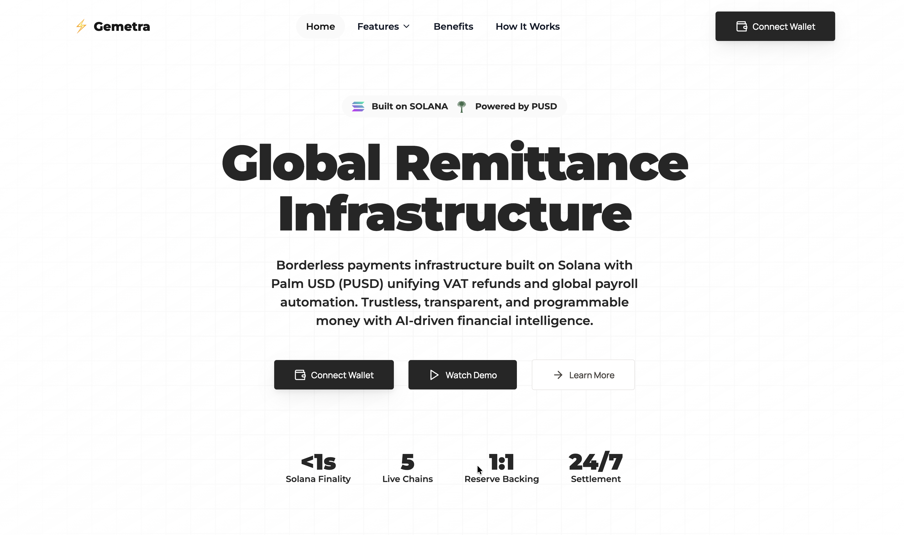
  </a>
</p>

*Click the thumbnail above to watch the demo video on YouTube*


---

## 🚀 Overview

**Gemetra PUSD** is an **on-chain VAT Refund & Payroll Payment Infrastructure** centred on **Solana**, with **Palm USD (PUSD)** as the default stable payout rail and **native SOL** available as an alternate disbursement token in the same flows.

Using **PUSD** SPL on Solana (**mint** `CZzgUBvxaMLwMhVSLgqJn3npmxoTo6nzMNQPAnwtHF3s`) plus **SOL** for native transfers, this platform enables:

1. **VAT Refunds** – Tourists submit refund requests → receive **PUSD** or **SOL** on Solana (any [Wallet Standard](https://github.com/anza-xyz/wallet-standard) / adapter–supported wallet); Solana Pay QR supports the selected asset.
2. **VAT Admin Panel** – Operators can view, filter, and export VAT refund claims (receipt info, personal info, merchant info, payment details)—tighten access with Supabase **RLS** in production. 
3. **Payroll Automation** – Employers upload CSV → AI computes salaries → employees receive **PUSD** or **SOL** payouts, chosen before send.
4. **Scheduled Payments** – Automate recurring and one-time payments with calendar view, per-schedule **token** (PUSD or SOL), and pre-approval system.
5. **Points & Rewards** – Earn points for transactions and convert toward **PUSD** (spec under **Documentation** below).
6. **AI Assistant** – Instant answers about payroll, payments, and blockchain technology.

---

## 🛑 Problem

- **Tourist VAT Refunds** are slow, manual, and often unclaimed due to airport delays ($50B+ lost annually).
- **Global Payroll** is plagued by high fees (2-5%), delayed wires (3-5 days), hidden FX costs, and compliance overhead.
- Both processes rely on **centralized, fragmented rails** that fail in a borderless world.

---

## ✅ Solution

**Gemetra PUSD** provides a **wallet-native remittance infrastructure** where:
- Tourists **receive VAT refunds** in **PUSD** or **SOL** on **Solana** with transparent tx hashes verifiable on **Solscan** (and Solana Pay / QR flows where enabled).
- Employers **disburse payroll** via **PUSD SPL** or **native SOL** transfers (typically **multiple recipients** in the bulk payroll flow).
- **Automated scheduled payments** support recurring payroll and one-time future runs, each stored with a **token** so processing uses the right on-chain path.
- **Points system** rewards activity and converts toward **PUSD**.
- **Transparency**: on-chain confirmations plus Supabase-backed records for reporting (including `payments.token` for PUSD vs SOL).

---

## ⚡ System Architecture

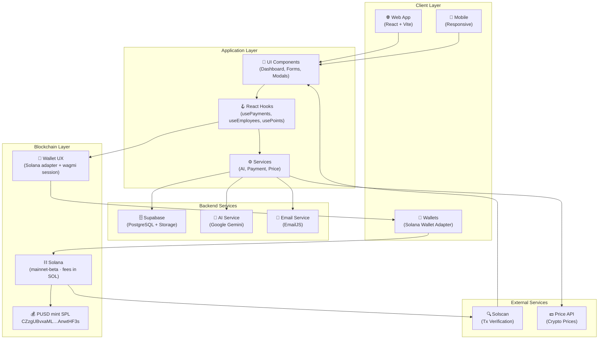

---

## 📊 Database Schema

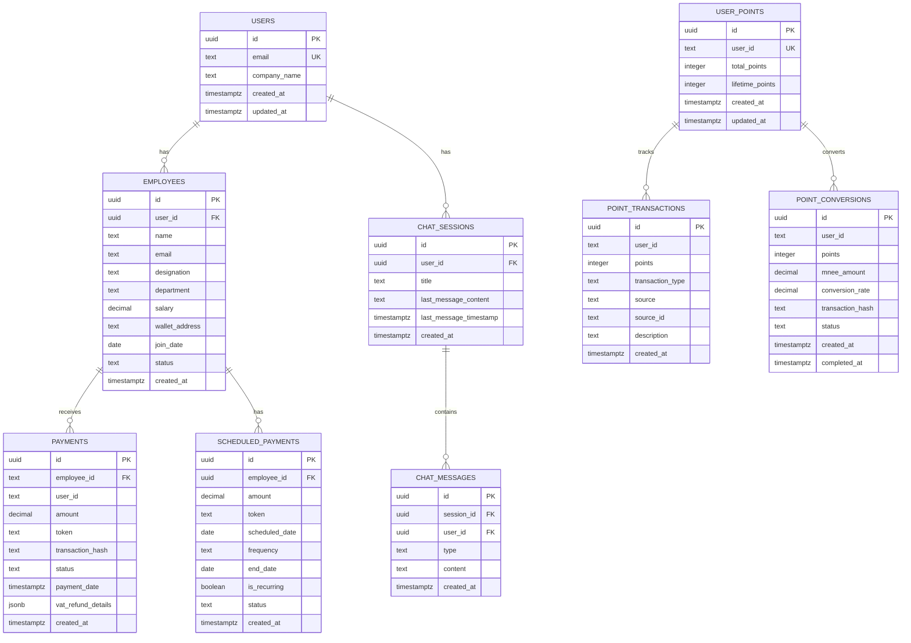

*DB column `mnee_amount` stores the converted **PUSD** amount in the app UI; the name is legacy.*

---

## 💸 Payment Flow (Bulk Payroll)

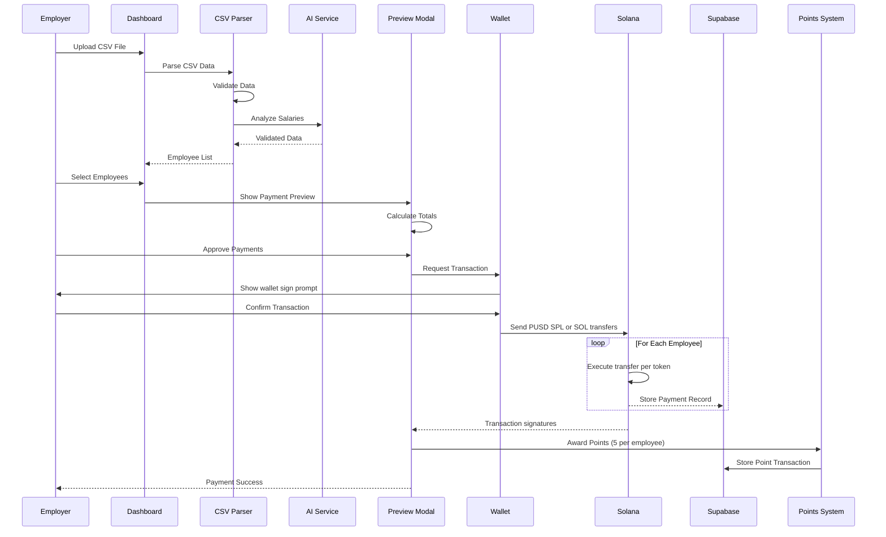

---

## 🧾 VAT Refund Flow

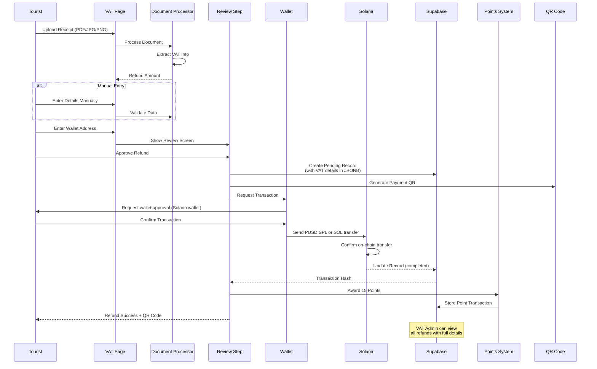

---

## 📅 Scheduled Payments Flow

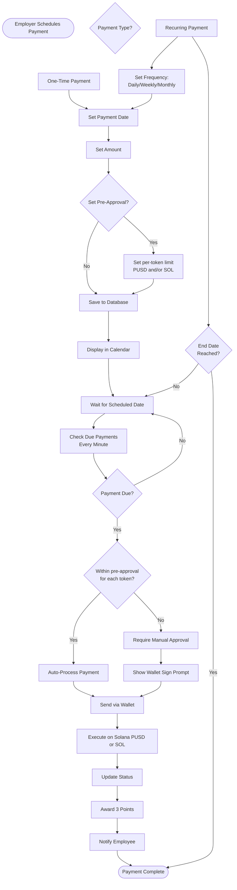

---

## 🎁 Points System Flow

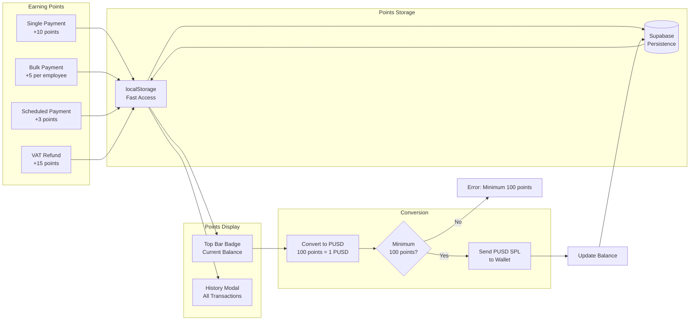

---

## 🏛️ VAT Admin Panel Flow

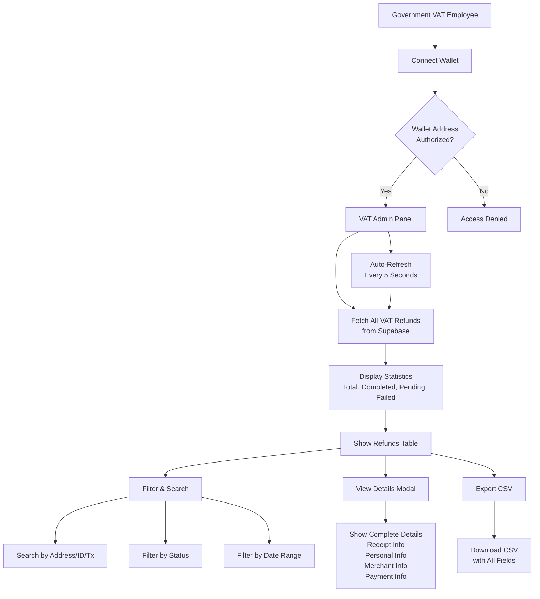

---

## 🤖 AI Assistant Flow

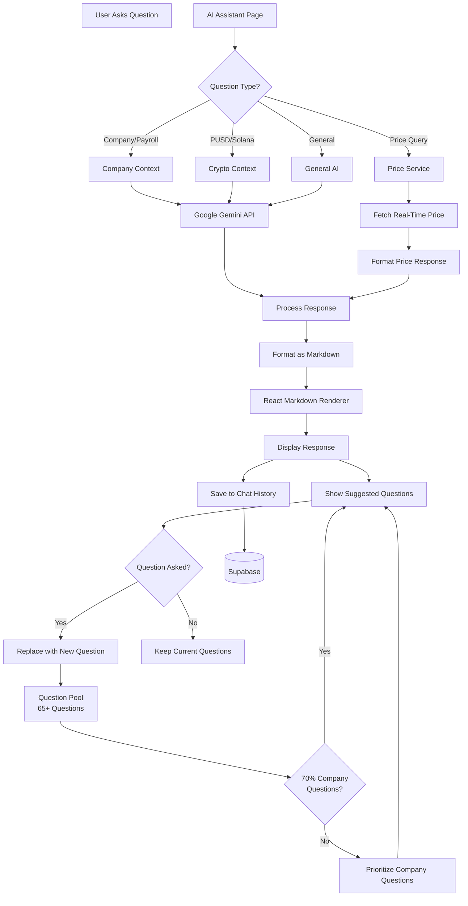

---

## 🏗️ Component Architecture

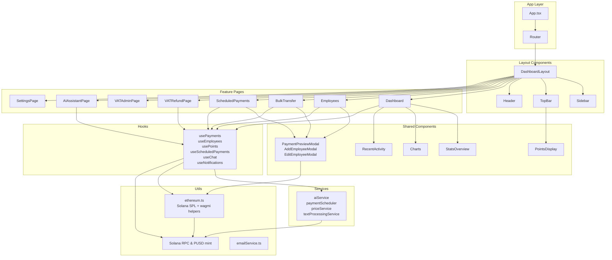

---

## 🔮 Features

- **Wallet-Native UX**: Connect via **@solana/wallet-adapter** (Phantom, Solflare, Ledger, WalletConnect, Coinbase, Trust, Torus, and many more) for **PUSD SPL** or **native SOL** transfers.
- **Tourism-Grade Simplicity**: Refunds in 3 steps → Upload → Review → Confirm.
- **VAT Admin Dashboard**: 
  - Wallet-based access control for authorized government employees
  - View all VAT refunds with complete details (receipt, personal, merchant, payment info)
  - Filter by status, date, and search by address/ID/transaction
  - Export all data to CSV for compliance and reporting
  - Real-time updates with auto-refresh every 5 seconds
- **Enterprise Payroll**: AI-driven salary parsing and bulk payouts on Solana (**PUSD** SPL or **SOL**, per run).
- **Dashboard data**: `EmployeesProvider` and `PaymentsProvider` keep employees and payments in sync across nested views after you add or edit records (no stale panels until a full refresh).
- **Scheduled & Recurring Payments**: 
  - Schedule one-time or recurring payments (daily, weekly, bi-weekly, monthly)
  - Pick **PUSD** or **SOL** when creating a schedule; due runs execute with that token
  - Calendar view to visualize all scheduled payments
  - Pre-approval system for automatic processing without repeated wallet prompts
  - **Per-token pre-approval limits** (separate caps for **PUSD** and **SOL**); auto-process runs only when due totals fit the limit for each token in play
- **Points & Rewards System**: earn on payroll, VAT, and scheduled flows; **100 points = 1 PUSD** conversion; in-app balance and history. Full tables and edge cases: **Documentation → Points System** (below).
- **AI Assistant**:
  - Powered by **Google Gemini** (default model **`gemini-2.5-flash`** in app code; override with `VITE_GEMINI_MODEL` if your key or region requires another model id)
  - 65+ pre-loaded questions, Markdown-formatted answers, and chat history in Supabase
  - Real-time crypto price information and company or payroll-oriented replies
- **Transparency**: On-chain **PUSD** and **SOL** payouts are verifiable on **Solana** (e.g. Solscan).
- **Compliance Ready**: Supabase logs + JSON/CSV exports for regulators and finance teams.
- **VAT Refund Details Storage**: All form data (VAT reg number, receipt number, passport, flight, merchant info, etc.) stored in JSONB column for complete audit trail.
- **Token integration**: Default stable payouts use the **PUSD SPL mint** on Solana; **SOL** uses native `SystemProgram` transfers (see `src/utils/ethereum.ts` — `sendPayment`, `sendBulkPayments`).

---

## 🛠️ Tech Stack

- **Blockchain (settlements)**: **Solana** — **PUSD (Palm USD)** SPL mint (default payroll/refund stable unit)  
  `CZzgUBvxaMLwMhVSLgqJn3npmxoTo6nzMNQPAnwtHF3s`  
  - Optional disbursements in **native SOL** (same wallet UX; amount fields are in the selected token).
  - Configure a reliable RPC via `VITE_SOLANA_RPC_URL` (recommended for production; public endpoints may rate-limit).

- **Wallet Integration**: **Solana Wallet Adapter** (`ConnectionProvider` + `WalletModal`) for signing **SPL** and **native SOL** transfers. **`VITE_WALLETCONNECT_PROJECT_ID`** is **optional**: when set, the app registers the Solana **WalletConnect** adapter (helpful for mobile / QR flows); injected wallets (Phantom, Solflare, and others) work without it.
  - Solana wallet-first flow for payroll and VAT settlement UX.
  - **wagmi** is still used in parts of the dashboard for session detection and legacy connectors alongside Solana.
  - Custom wallet selection modal with filtering and ordering.

- **AI Layer**: Google Gemini (`@google/generative-ai`)
  - Default generation model **`gemini-2.5-flash`** unless `VITE_GEMINI_MODEL` is set
  - Natural language payroll insights, suggested questions, and general crypto help
  - Real-time crypto prices via the in-app price service where relevant

- **Backend**: [Supabase](https://supabase.com/)
  - Postgres DB, object storage, user audit logs, and compliance artifacts.
  - Row Level Security (RLS) for data protection

- **Frontend**: React + Vite
  - Modern UI with Tailwind CSS and Framer Motion.
  - Responsive design for mobile and desktop

- **Transaction verification**: RPC + Solana explorers (e.g. Solscan) for payout signatures.

---

## 📡 Data Flow

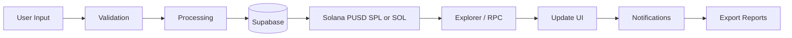

1. **Input**
   - VAT Refunds: Retailer receipts, passport/KYC snapshots.
   - Payroll: Employer CSV with gross pay data.

2. **Processing**
   - AI parses salaries, deductions, taxes.
   - AI validates VAT eligibility & calculates refunds.

3. **Persistence**
   - Supabase stores invoices, payruns, logs, validation proofs.

4. **Execution**
   - App builds a **Solana SPL** transfer for **PUSD** or a **native SOL** transfer when **SOL** is selected → user signs with their connected adapter wallet and submits to the network.

5. **Finality**
   - Solana confirms the transaction (signatures inspectable via RPC / explorers).
   - Supabase logs for audit.

6. **Audit**
   - Export JSON/CSV/PDF reports for regulators & enterprise compliance.

---

## 🔐 Security & Compliance

- **Wallet-Based Auth**: No passwords, wallet addresses as user IDs
- **Row Level Security**: Supabase RLS policies ensure data isolation
- **Transaction verification**: SPL transfers are anchored by Solana **signatures** (inspectable via RPC / explorers).
- **Immutable audit trail**: Supabase plus on-chain signatures support verifiable record-keeping.
- **Circuit breakers**: Scheduled-payment **per-token** pre-approval limits reduce risk of unintended large auto-runs
- **Data Encryption**: All sensitive data encrypted at rest and in transit

---

## 💰 Business Model

- **Platform Fees**: 0.5% per payout (tourist refund / payroll).
- **Enterprise SaaS**: Subscription-based dashboards & compliance exports for HR/finance teams.
- **Partnership Revenue**: Integration fees with VAT Operators & HR SaaS providers.
- **Future Yield**: Earn yield on idle treasury balances + capture micro-spreads on FX conversions.

---

## 📈 Go-To-Market (GTM)

- **Phase 1 – Tourism**:
  Pilot deployment at major airports with VAT operator integration.

- **Phase 2 – Payroll**:
  Target **DAOs, Web3 startups, and SMEs** with **PUSD-on-Solana** payroll rails.

- **Phase 3 – Enterprise Expansion**:
  Partner with **multinationals** and expand VAT refunds to EU, UK, Singapore, and Saudi Arabia.

- **Phase 4 – DAO Governance**:
  Transition to community-driven governance of refund % rates, fee splits, and expansion markets.

---

## 🔮 Roadmap

- ✅ **MVP**: Wallet-native VAT refunds + CSV-based payroll automation with **PUSD (Solana SPL)** and optional **SOL** disbursements.
- ✅ **Scheduled Payments**: Calendar view, recurring payments, and pre-approval system.
- ✅ **Points System**: Earn points for transactions, convert toward **PUSD**.
- ✅ **AI Assistant**: Natural language interface for payroll and crypto questions.
- ✅ **VAT Admin Panel**: Government dashboard for viewing, filtering, and exporting all VAT refund claims with complete details.
- 🔄 **Next**: Multi-country VAT support + AI-driven tax compliance engine.
- 🔄 **Later**: Enterprise integrations, PDF-based compliance exports, multi-signature approvals.
- 🌐 **Future**: Community / DAO governance around fee rails and expansion markets.

---

## 🌟 Why PUSD on Solana?

The app’s **default** tourism and payroll rail is **PUSD (Palm USD)** as an **SPL token** on Solana:

- **Wallet-native payouts**: Standard SPL transfers for PUSD through any supported Solana browser / mobile wallet.
- **Fast confirmation**: Finality tuned for responsive tourism and payroll workflows.
- **Composable ecosystem**: SPL is the common token surface across Solana DeFi and apps.
- **Verifiable settlements**: Transactions are observable via Solana RPC and public explorers (e.g. Solscan).
- **Enterprise fit**: Stable unit of account paired with streamlined bulk and scheduled disbursements.

---

## 🏆 Stack highlights

✅ **PUSD on Solana (SPL)** — Mint `CZzgUBvxaMLwMhVSLgqJn3npmxoTo6nzMNQPAnwtHF3s`  
✅ **Native SOL payouts** — Same flows where token = SOL is selected  
✅ **Commerce tooling** — VAT refunds and payroll disbursement flows  
✅ **Financial automation** — Scheduling, previews, and batch-friendly payouts  
✅ **AI-assisted ops** — Salary parsing and in-app assistant (Gemini)

---

## 📦 Installation

```bash
# Install dependencies
npm install
# or
pnpm install

# Set up environment variables
cp .env.example .env
# Add at least Supabase URL + anon key; see Configuration below for optional keys

# Run development server
npm run dev
# or
pnpm dev

# Build for production
npm run build
# or
pnpm build
```

---

## 🔧 Configuration

### Environment Variables

Create a `.env` file in the root directory with the following variables:

#### Required variables

```env
# Supabase (required for data persistence, chat history, VAT records, etc.)
VITE_SUPABASE_URL=your_supabase_url
VITE_SUPABASE_ANON_KEY=your_supabase_anon_key
```

#### Optional variables

```env
# WalletConnect — optional. When set, enables the Solana WalletConnect adapter
# (see src/solana/createSolanaWalletAdapters.ts). Injected wallets work without it.
VITE_WALLETCONNECT_PROJECT_ID=your_walletconnect_project_id

# Solana RPC — recommended in production; public RPCs may throttle or fail
# VITE_SOLANA_RPC_URL=https://your-solana-rpc-endpoint

# Gemini AI — optional; required only if you use the in-app AI assistant
VITE_GEMINI_API_KEY=your_gemini_api_key
# Optional model id (defaults to gemini-2.5-flash in app code if unset)
# VITE_GEMINI_MODEL=gemini-2.5-flash

# EmailJS — optional; for email notifications
VITE_EMAILJS_PUBLIC_KEY=your_emailjs_public_key
VITE_EMAILJS_SERVICE_ID=your_emailjs_service_id
VITE_EMAILJS_TEMPLATE_ID=your_emailjs_template_id
```

**Quick setup**

1. Copy `.env.example` to `.env`.
2. Add your **Supabase** URL and anon key (minimum to run the app with persistence).
3. Optionally add **WalletConnect**, **Gemini**, **EmailJS**, and/or **`VITE_SOLANA_RPC_URL`** as needed (see comments in `.env.example`).
4. Restart the dev server: `npm run dev`.

If the Gemini API rejects the default model for your key or region, set `VITE_GEMINI_MODEL` to a supported id (for example `gemini-2.0-flash`).

### PUSD mint (Solana SPL)

Production payouts use this mint (also exported as `PUSD_SOLANA_MINT` in code):

- **Mint**: `CZzgUBvxaMLwMhVSLgqJn3npmxoTo6nzMNQPAnwtHF3s`
- **Network**: Solana **mainnet** (match your deployment and wallet cluster).

Set `VITE_SOLANA_RPC_URL` in `.env` (see **Optional Variables** above) when you need a dedicated RPC instead of defaults.

**Testing:** Keep **SOL** for network fees. For **PUSD** runs, fund the employer wallet with **PUSD** SPL at the mint above. For **SOL** runs, fund enough **SOL** to cover the payout amounts plus fees.

---

## 📚 Documentation

- **[Points System](POINTS_SYSTEM.md)** — Earning rules (per flow), **100 points → 1 PUSD** conversion, and how history is stored.
- **`samples/`** — Example receipts and VAT JSON (`samples/receipt_template.txt`, `samples/vat_receipt_sample.json`).
- **This README** — Installation, environment variables, architecture, and Solana payout configuration (sections above).

Additional topical `.md` files may be added to the repo over time; links are intentionally kept minimal so they stay valid.

---

## 🌐 Live Demo
- **Demo Video:** https://youtu.be/U1QJ2HDRRQE
- **Live Application**: https://gemetra-pusd.vercel.app/  
- **GitHub Repository**: https://github.com/AmaanSayyad/Gemetra-PUSD  
- **Pitch Deck**: https://docs.google.com/presentation/d/1CV3kaE1mY7rgmB9bTwZTBLGR6BdLryRtaHD4F3MK4M8/edit?usp=sharing

---

## 📄 License

This project is licensed under the MIT License - see the [LICENSE](LICENSE) file for details.

---

## 👥 Contact

- **Email**: amaansayyad2001@gmail.com
- **Telegram**: [@amaan029](https://t.me/amaan029)
- **GitHub**: [@AmaanSayyad](https://github.com/AmaanSayyad)
