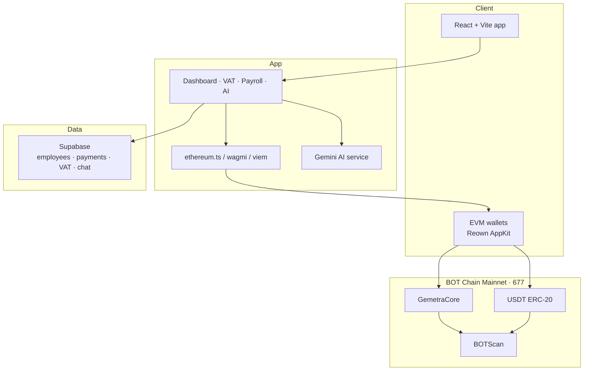
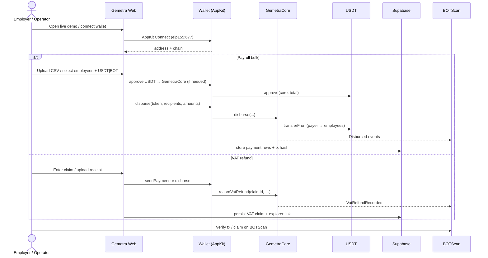
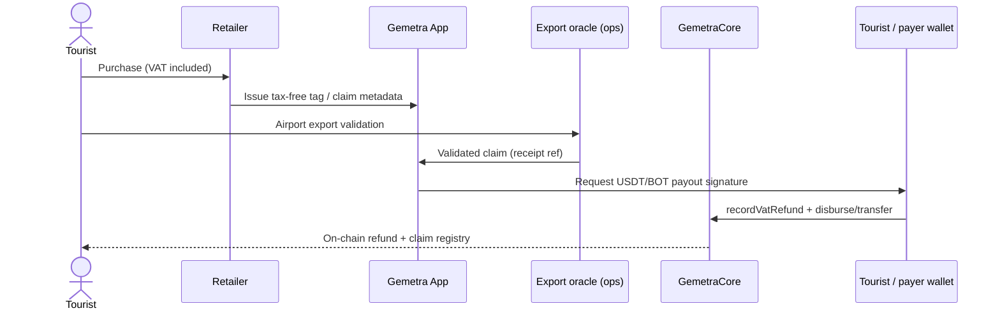
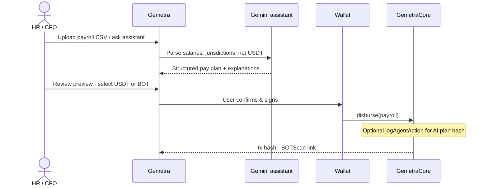
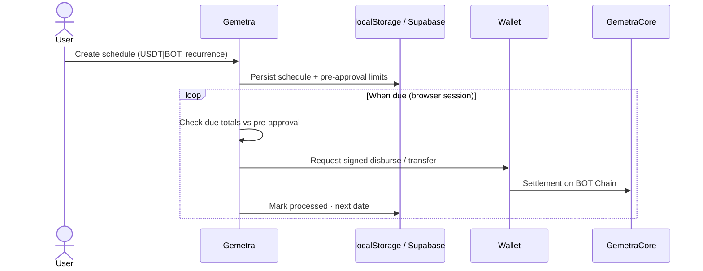

# Gemetra — BOT Chain Mainnet

**Global remittance for VAT refunds & payroll**  
Wallet-native · AI-assisted · **USDT + native BOT** on **BOT Chain Mainnet** (chain ID **677**)

| | |
| --- | --- |
| **Live demo** | https://gemetra-botchain-ten.vercel.app |
| **GitHub** | https://github.com/AmaanSayyad/Gemetra-BotChain |
| **Demo video** | https://youtu.be/U1QJ2HDRRQE |
| **Explorer (GemetraCore)** | https://scan.botchain.ai/address/0xf924220b12dbedb039245c0b960b7dbb37bf1eb2 |
| **Challenge brief** | [CHALLENGE_SUBMISSION.md](./CHALLENGE_SUBMISSION.md) |

---

## Overview

Gemetra is a **consumer-ready** remittance product on BOT Chain that unifies two real-world money flows:

1. **RWA / VAT refunds** — tourist tax reclaim claims with on-chain settlement and claim registry  
2. **AI-assisted payroll** — CSV/AI parsing → wallet-signed **USDT** or **BOT** batch disbursement  

Users connect an EVM wallet (MetaMask, BO Wallet, WalletConnect via Reown AppKit), stay in custody of funds, and complete the full business loop on **mainnet**.

---

## Challenge tracks (AI × RWA)

| Track | How Gemetra maps |
| --- | --- |
| **RWA** | VAT claims are real-world tax assets; payroll is real-world wage distribution; `recordVatRefund` + `disburse` close the on-chain loop |
| **AI Native** | Gemini powers salary parsing, compliance Q&A, and ops assistance over company data; designed to feed payroll plans that settle on-chain |

See [CHALLENGE_SUBMISSION.md](./CHALLENGE_SUBMISSION.md) for requirement-by-requirement mapping, migration rationale, and review checklist.

---

## Mainnet deployment

| Item | Value |
| --- | --- |
| Network | BOT Chain Mainnet |
| Chain ID | `677` |
| RPC | `https://rpc.botchain.ai` |
| Explorer | `https://scan.botchain.ai` |
| **GemetraCore** | `0xf924220b12dbedb039245c0b960b7dbb37bf1eb2` |
| Deploy tx | `0xb565ca7f27e8a8055f4bfe19ebb05da711d62072f6200f46657bdff326a64443` |
| Deployer | `0x562d89c9709B5F51dDAcABafC8e0e7A074186428` |
| USDT (ERC-20) | `0xababc7ddc03e501d190c676bf3d92ef0e6e87a3c` |

Artifact: [`deployments/botchain-mainnet.json`](./deployments/botchain-mainnet.json)  
Contract: [`contracts/GemetraCore.sol`](./contracts/GemetraCore.sol)

`GemetraCore` never custody funds. It:

- **`disburse`** — batch native BOT or ERC-20 USDT `transferFrom` payer → recipients  
- **`recordVatRefund`** — immutable VAT claim registry event  
- **`logAgentAction`** — AI / agent audit trail for on-chain decision logging  

---

## System architecture



---

## End-to-end product loop



---

## VAT refund (RWA) sequence



---

## Payroll + AI assist sequence



---

## Scheduled payments sequence



---

## Features

- **Wallet-native UX** — Reown AppKit (MetaMask, Family/BO Wallet, WalletConnect, Coinbase)  
- **VAT refunds** — claim form, payout in USDT/BOT, on-chain `recordVatRefund`  
- **VAT admin** — filter/export claims (harden with Supabase RLS in production)  
- **Bulk payroll** — CSV + preview + `GemetraCore.disburse`  
- **Scheduled payments** — calendar, recurrence, per-token pre-approval  
- **Points** — earn on activity; convert toward USDT ([POINTS_SYSTEM.md](./POINTS_SYSTEM.md))  
- **AI assistant** — Gemini over company context + BOT Chain product facts  

---

## Stack

| Layer | Tech |
| --- | --- |
| Frontend | React 18, Vite, Tailwind, Framer Motion |
| Wallets | wagmi v3, viem, `@reown/appkit` |
| Chain | BOT Chain Mainnet `677` |
| Contracts | Solidity `GemetraCore` |
| Data | Supabase (Postgres) |
| AI | Google Gemini (`VITE_GEMINI_API_KEY`) |
| Hosting | Vercel |

---

## Quick start

```bash
pnpm install
cp .env.example .env
# set VITE_SUPABASE_* and mainnet vars (see below)
pnpm dev
```

### Environment (production / mainnet)

```env
VITE_SUPABASE_URL=...
VITE_SUPABASE_ANON_KEY=...
VITE_WALLETCONNECT_PROJECT_ID=...
VITE_BOTCHAIN_NETWORK=mainnet
VITE_GEMETRA_CORE_ADDRESS=0xf924220b12dbedb039245c0b960b7dbb37bf1eb2
# optional
VITE_GEMINI_API_KEY=...
VITE_GEMINI_MODEL=gemini-2.5-flash
```

Testnet remains available via `VITE_BOTCHAIN_NETWORK=testnet` for local experiments; **challenge / production use mainnet**.

### Deploy contracts (optional)

```bash
pnpm wallet:create          # writes gitignored .deployer.json
pnpm deploy:core            # BOTCHAIN_NETWORK=mainnet by default
```

---

## Documentation

| Doc | Purpose |
| --- | --- |
| [CHALLENGE_SUBMISSION.md](./CHALLENGE_SUBMISSION.md) | BOT Builder Challenge #2 checklist & migration answers |
| [POINTS_SYSTEM.md](./POINTS_SYSTEM.md) | Points earn/convert flow |
| [VAT_REFUND_DOCUMENT_FORMAT_GUIDE.md](./VAT_REFUND_DOCUMENT_FORMAT_GUIDE.md) | Receipt / claim document formats |
| [VAT_REFUND_SAMPLE_DATA.md](./VAT_REFUND_SAMPLE_DATA.md) | Sample VAT claim payloads |
| `samples/` | JSON / CSV examples |

---

## Why BOT Chain (migration)

Gemetra previously targeted another L1. The BOT Chain version adds:

- **Mainnet `GemetraCore`** settlement + VAT registry + agent log  
- **EVM wallet stack** (AppKit) and bridged **USDT**  
- **Native BOT** gas + optional native payroll/refund payouts  
- Frontend locked to chain **677** with BOTScan explorers  

Continued growth: SME payroll + tourist VAT corridors, keep iterating on BOT mainnet (see challenge doc).

---

## License & contact

MIT — see [LICENSE](./LICENSE)

- Email: amaansayyad2001@gmail.com  
- GitHub: [@AmaanSayyad](https://github.com/AmaanSayyad)  
- Telegram: [@amaan029](https://t.me/amaan029)
