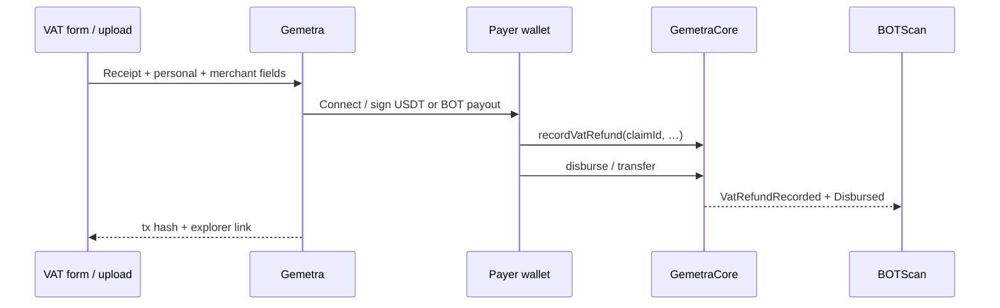

# VAT Refund Form — Sample Data (BOT Chain)

| | |
| --- | --- |
| **Live demo** | https://gemetra-botchain-ten.vercel.app |
| **Demo video** | https://youtu.be/j9PxVo5DRxE |
| **Format guide** | [VAT_REFUND_DOCUMENT_FORMAT_GUIDE.md](./VAT_REFUND_DOCUMENT_FORMAT_GUIDE.md) |
| **GemetraCore** | https://scan.botchain.ai/address/0xf924220b12dbedb039245c0b960b7dbb37bf1eb2 |

**RWA sample payloads** for tourist **VAT reclaim claims** on **BOT Chain Mainnet**. Receiver addresses are **EVM (`0x…`)** wallets. Payouts settle in **USDT** (default) or native **BOT**.

---

## Sample 1: Luxury Watch Purchase (Dubai)

### Receipt Information
- **VAT Registration No.**: GB987654321
- **Receipt/Invoice No.**: DXB-2024-084729
- **Total Bill Amount**: 12,500.00 AED
- **VAT Amount**: 625.00 AED
- **Purchase Date**: 15/12/2024
- **Receiver Wallet Address**: `0x742d35Cc6634C0532925a3b844Bc9e7595f0bEb0`
- **Payout Token**: USDT (BOT Chain Mainnet)
- **Refund Amount (USDT)**: 170.00

### Personal Information
- **Passport Number**: G12345678
- **Flight Number**: EK205
- **Country of Nationality**: United Kingdom
- **Date of Birth**: 23/05/1987

### Merchant Information
- **Merchant Name**: The Dubai Mall - Rolex Boutique
- **Merchant Address**: Unit 206, The Dubai Mall, Financial Centre Road, Dubai, UAE

---

## Sample 2: Electronics Purchase (London)

### Receipt Information
- **VAT Registration No.**: GB234567890
- **Receipt/Invoice No.**: LDN-2024-156892
- **Total Bill Amount**: 3,450.00 GBP
- **VAT Amount**: 575.00 GBP
- **Purchase Date**: 08/11/2024
- **Receiver Wallet Address**: `0x8ba1f109551bD432803012645Ac136c22C175900`
- **Payout Token**: USDT (BOT Chain Mainnet)
- **Refund Amount (USDT)**: 156.50

### Personal Information
- **Passport Number**: P7654321
- **Flight Number**: BA286
- **Country of Nationality**: United States
- **Date of Birth**: 14/09/1992

### Merchant Information
- **Merchant Name**: Harrods Electronics Department
- **Merchant Address**: 87-135 Brompton Road, Knightsbridge, London SW1X 7XL, United Kingdom

---

## Sample 3: Fashion & Accessories (Paris)

### Receipt Information
- **VAT Registration No.**: FR12345678901
- **Receipt/Invoice No.**: PAR-2024-092341
- **Total Bill Amount**: 2,800.00 EUR
- **VAT Amount**: 466.67 EUR
- **Purchase Date**: 22/10/2024
- **Receiver Wallet Address**: `0x1234567890123456789012345678901234567890`
- **Payout Token**: USDT (BOT Chain Mainnet)
- **Refund Amount (USDT)**: 127.00

### Personal Information
- **Passport Number**: M9876543
- **Flight Number**: AF1234
- **Country of Nationality**: Canada
- **Date of Birth**: 07/03/1985

### Merchant Information
- **Merchant Name**: Galeries Lafayette - Champs-Élysées
- **Merchant Address**: 40 Boulevard Haussmann, 75009 Paris, France

---

## Sample 4: Jewelry Purchase (Dubai)

### Receipt Information
- **VAT Registration No.**: GB345678901
- **Receipt/Invoice No.**: DXB-2024-112567
- **Total Bill Amount**: 8,750.00 AED
- **VAT Amount**: 437.50 AED
- **Purchase Date**: 03/12/2024
- **Receiver Wallet Address**: `0xabcdef1234567890abcdef1234567890abcdef12`
- **Payout Token**: BOT (native) *or* USDT
- **Refund Amount**: 119.00 (stable units if USDT)

### Personal Information
- **Passport Number**: A12345678
- **Flight Number**: QR815
- **Country of Nationality**: Australia
- **Date of Birth**: 19/11/1990

### Merchant Information
- **Merchant Name**: Damas Jewellery - Mall of the Emirates
- **Merchant Address**: Level 2, Mall of the Emirates, Sheikh Zayed Road, Dubai, UAE

---

## Sample 5: Designer Clothing (Milan)

### Receipt Information
- **VAT Registration No.**: IT09876543210
- **Receipt/Invoice No.**: MIL-2024-078234
- **Total Bill Amount**: 1,950.00 EUR
- **VAT Amount**: 390.00 EUR
- **Purchase Date**: 18/09/2024
- **Receiver Wallet Address**: `0x562d89c9709B5F51dDAcABafC8e0e7A074186428`
- **Payout Token**: USDT (BOT Chain Mainnet)
- **Refund Amount (USDT)**: 106.00

### Personal Information
- **Passport Number**: C8765432
- **Flight Number**: LH247
- **Country of Nationality**: Germany
- **Date of Birth**: 25/07/1988

### Merchant Information
- **Merchant Name**: Gucci Boutique - Via Montenapoleone
- **Merchant Address**: Via Montenapoleone 5, 20121 Milano, Italy

---

## Notes

- Receiver addresses must be valid **BOT Chain / EVM** addresses (`0x` + 40 hex).  
- On-chain registry: `GemetraCore.recordVatRefund` · settlement: `disburse` / ERC-20 `transfer`.  
- USDT mainnet: `0xababc7ddc03e501d190c676bf3d92ef0e6e87a3c`.  
- VAT rates illustrated: UAE 5%, UK/FR 20%, IT 22%.  
- Verify payouts on [BOTScan](https://scan.botchain.ai).

## See also

- [VAT_REFUND_DOCUMENT_FORMAT_GUIDE.md](./VAT_REFUND_DOCUMENT_FORMAT_GUIDE.md)  
- `samples/vat_receipt_sample.json`  
- `samples/vat_receipts_bulk.csv`  
